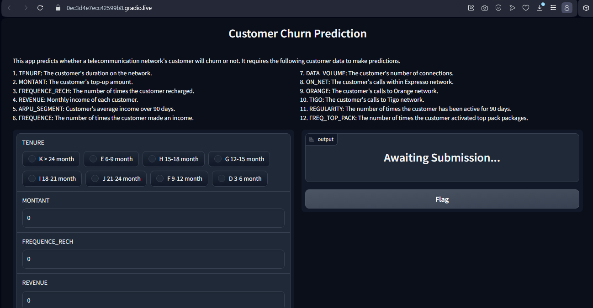

# EXPRESSO CUSTOMER CHURN CHALLENGE ON ZINDI

## Technologies

## Project Description

Welcome to the **Expresso Customer Churn Challenge On Zindi**. The aim of this challenge is to analyze the customer churn data of Expresso, a prominent telecommunication network. Afterwards, Machine Learning models will be trained to predict customer churn for the company using the customer churn data. The best model will be selected based on the AUC scores of the trained models. This best model will be used to make predictions on new customer data that it has not seen before. This will help the company monitor the churn tendencies of their customers, enabling them to know in advance the customers that are likely to churn, and make informed business decisions aimed at retaining these customers. The predictions, along with the user_ids of the customers on the new customer data, will be saved as a csv file for submission on Zindi.

The best model, along with other Machine Learning components (such as the imputer, encoder, and scaler) used to prepare the customer churn data for modelling will be exported using pickle. They will then be used to build user-friendly apps using Gradio and Streamlit libraries, as well as a FastAPI web interface. These will simplify the usage of the model to make customer churn predictions for new customers based on their available data. Finally, these apps and API will be containerized using docker and deployed to Huggingface to make them publicly available.

## Preview

Below is a preview showcasing some features of the notebook:

    

        
Overall Churn Rate Of The Telecommunication Network

        
    

    

        
Churn Rate by Tenure

        
        

    

        
Churn Rate by Region

        
        

    

        
Confusion Matrix of the Best Model

        
    

    

        
Precision-Recall Curve of the Best Model

        
    

## Prerequisites for the Apps and Web API

Ensure that you install the following libraries in your Python environment or virtual environment:

* Gradio
* Streamlit
* FastAPI
* Tabulate
* Uvicorn
* Pandas
* Logistic Regression

The libraries can be installed using the following command:

## Setup

To set up and run the apps in your local environment, follow these instructions:

1. Clone this repository to your local machine using the following command. Replace \<repository-url\> with the actual url to this repository:

2. Create and activate a virtual environment:

3. Install requirements.txt:

4. Run the apps using the following commands:

- For Gradio

- For Streamlit

- For FastAPI

Each of the apps will be launched in your default web browser and can then be used to make predictions based on the customer information provided.

## Interfaces

## App and API Usage Instructions

Input Fields: The app displays input fields for the customer information.
Prediction: Click the "Submit", "Predict Customer Churn", or "Execute" button to get a prediction based on the provided inputs on the Gradio, Streamlit or FAstAPI interface respectively.
Results: The app will display whether the customer is likely to churn or not based on the customer data in the input field.

## Authors

| Name                | Profile                                                                                                                                                                                                                                   | Articles |
| ------------------------ | ------------------------------------------------------------------------------------------------------------------------------------------------------------------------------------------------------------------------------------------ | ----------- |
| Chidiebere David Ogbonna | [LinkedIn](https://www.linkedin.com/in/chidieberedavidogbonna/) |[Medium](https://eberedavid.medium.com)|
|                          |                                                                                                                                                                                                                                            |        |

| Name                | Profile                                                                                                                                                                   | Portfolio | Articles |
| ------------------- | -------------------------------------------------------------------------------------------------------------------------------------------------------------------------- | --------- | --------- |
| Chidiebere David Ogbonna | [LinkedIn](https://www.linkedin.com/in/chidieberedavidogbonna/) | [GitHub](https://github.com/iameberedavid) | [Medium](https://eberedavid.medium.com) |
| John Smith | [LinkedIn](https://www.linkedin.com/in/johnsmith/) |  | [Medium](https://medium.com/johnsmith) |
| Jane Doe | [LinkedIn](https://www.linkedin.com/in/janedoe/) |  | [Medium](https://medium.com/janedoe) |
| Alice Johnson | [LinkedIn](https://www.linkedin.com/in/alicejohnson/) |  | [Medium](https://medium.com/alicejohnson) |
| Alice Johnson | [LinkedIn](https://www.linkedin.com/in/alicejohnson/) |  | [Medium](https://medium.com/alicejohnson) |

## Acknowledgments

We would like to express our gratitude to the [Azubi Africa Data Analyst Program](https://www.azubiafrica.org/data-analytics) for their support and for offering valuable projects as part of this program. Not forgeting our scrum masters [Rachel Appiah-Kubi](https://www.linkedin.com/in/racheal-appiah-kubi/) & [Emmanuel Koupoh](https://github.com/eaedk)

## License

This project is licensed under the MIT License - see the [LICENSE.md](LICENSE.md) file for details.

## Contact

For questions, feedback, and collaborations, please contact [Chidiebere David Ogbonna](eberedavid326@gmail.com).